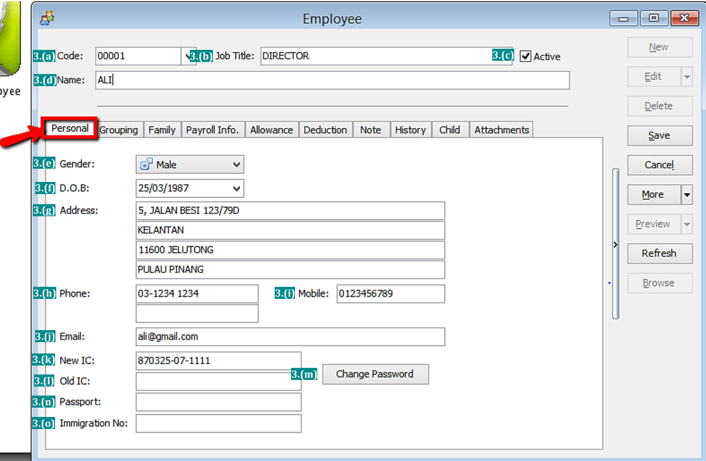
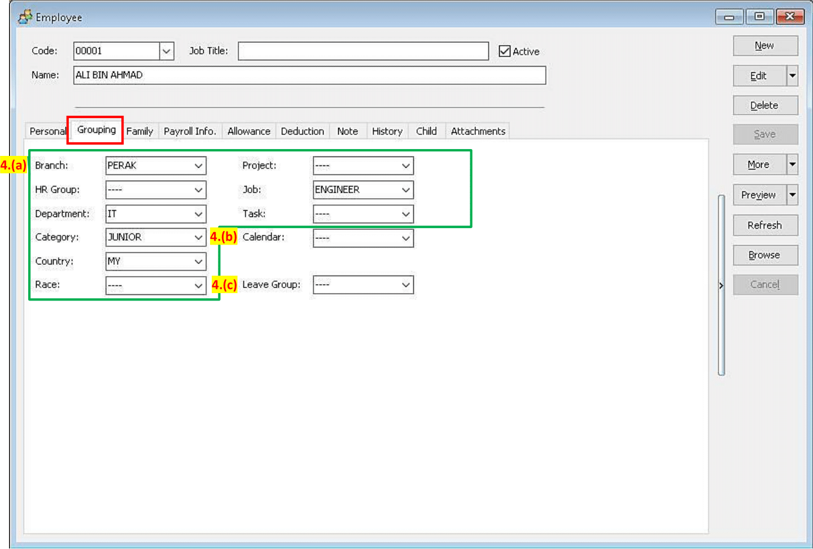
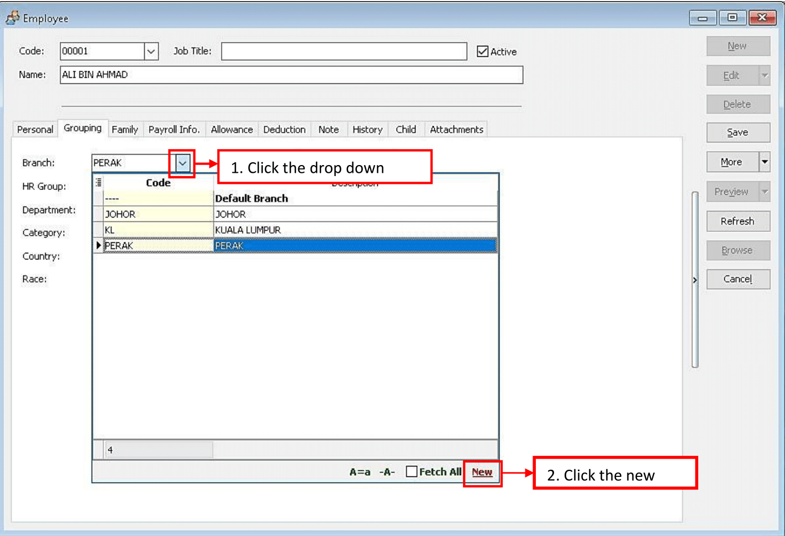
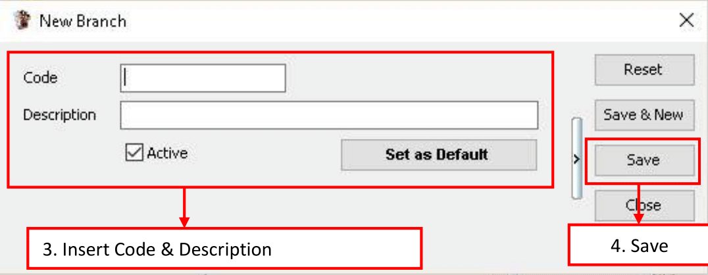
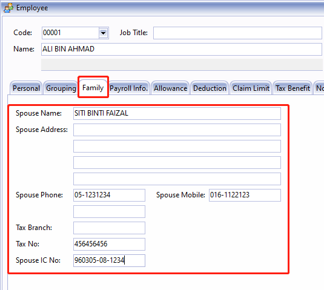
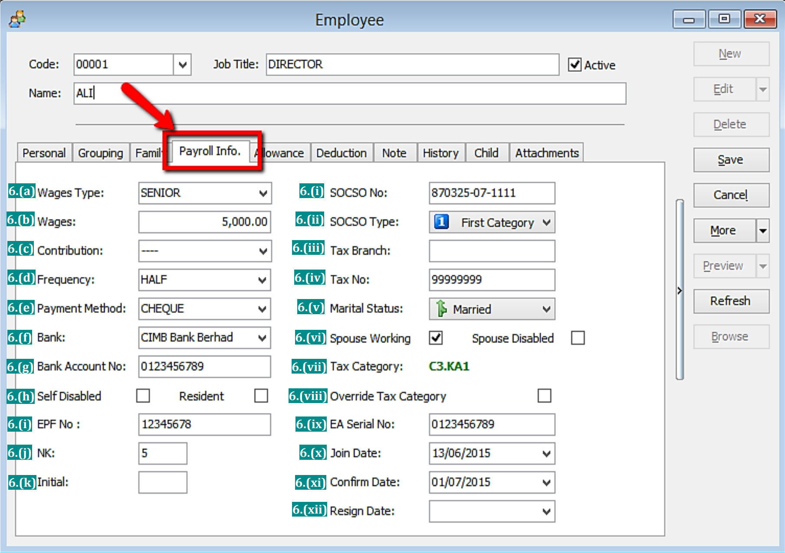
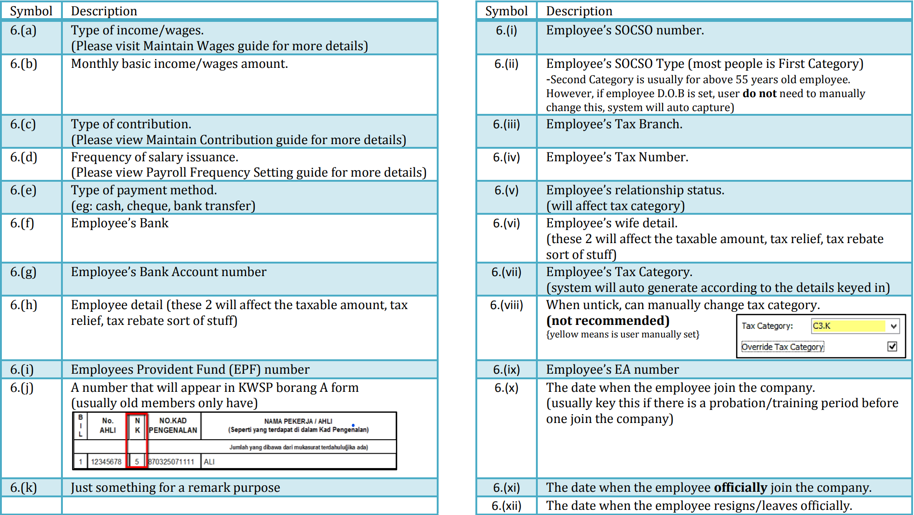
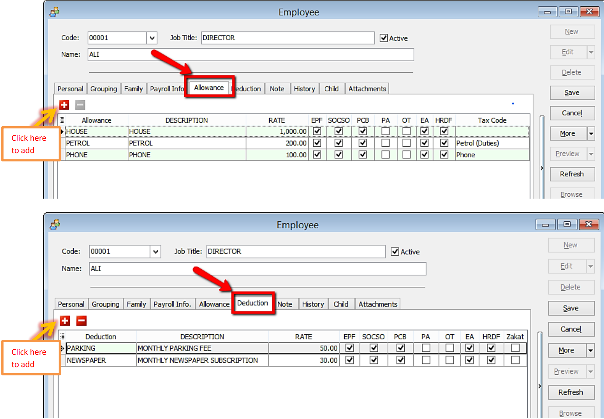
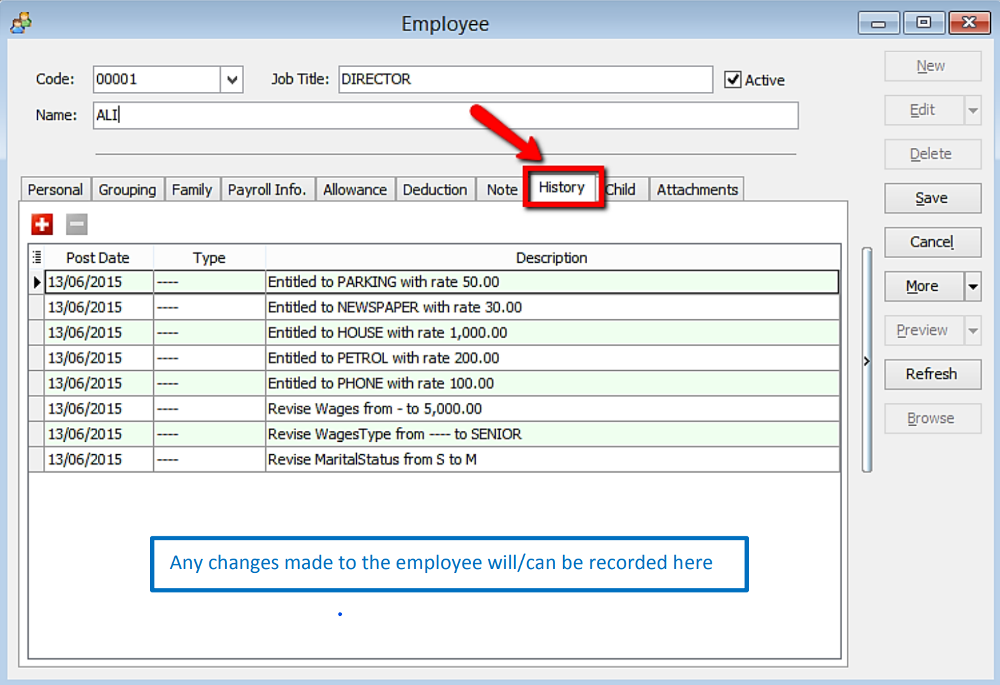
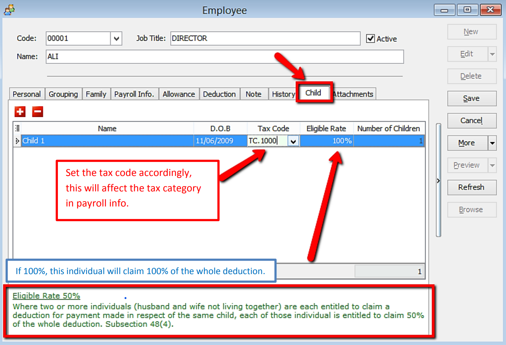

:::tip
Whenever a new staff/worker/person/crew enter the company, Maintain Employee is the place where user needs to key in the details
:::

## Setup

1. Navigate yourself to the Maintain Employee panel

   

   \*OR Click on the home page "Maintain Employee"\*\*

   

2. Click new to create new employee

   

3. Key in the employee’s personal details

   

   | Symbol | Description                                                                                    |
   | ------ | ---------------------------------------------------------------------------------------------- |
   | 3.(a)  | A unique code for the employee, it also act as a username for the employee to login.           |
   | 3.(b)  | The name of the position the employee will hold. (eg: chairman, secretary, auditor)            |
   | 3.(c)  | To be untick when an employee resigns. (if resign date is not set in payroll info.)            |
   | 3.(d)  | The name of the employee.                                                                      |
   | 3.(e)  | The gender/sex of the employee.                                                                |
   | 3.(f)  | The date of birth of the employee (recommended to set so that can capture the age)             |
   | 3.(g)  | The housing address of the employee.                                                           |
   | 3.(h)  | The house number of the employee.                                                              |
   | 3.(i)  | The handphone number of the employee.                                                          |
   | 3.(j)  | The email of the employee.                                                                     |
   | 3.(k)  | The Identification Card number of the employee.                                                |
   | 3.(l)  | The OLD Identification Card number of the employee. (only some very senior people will have)   |
   | 3.(m)  | The password for the employee to login his account. (need to set/change once in order to work) |
   | 3.(n)  | The passport number of the employee (usually only recorded for foreign worker)                 |
   | 3.(o)  | The immigration number of the employee                                                         |

4. Key in the employee’s grouping details

   

   | Symbol | Description                                                                                                                                                    |
   | ------ | -------------------------------------------------------------------------------------------------------------------------------------------------------------- |
   | 4.(a)  | Key in the branch/department/category of the employee in the company. (if the company doesn’t have so much grouping, just remain everything as default “----“) |
   | 4.(b)  | Select the type of calendar for the employee.                                                                                                                  |
   | 4.(c)  | Select the leave group for the employee. (please visit Maintain Leave guide for more info)                                                                     |

   :::tip

   The Purpose of Grouping setting is :

   - For Reference purpose.

   - For Report representation method by Group.

   :::

   1. To Create new Branch / HRGroup / Department/ Category / Country/ Race

   
   

5. Key in the employee’s family details

   

6. Key in the employee’s payroll information

   

   

7. Key in the employee’s monthly fix allowances/deductions

   

   - Create a new allowance/deduction

   

8. Add notes/remark and photo for the employee

   

9. History report of the employee

   

   :::tip
   You can manually update the history by clicking on ➕ button or click on ➖ button to remove unncessary history records
   :::

10. Add the employee’s children information (will affect tax category)

    

11. Add any attachment related to the employee

    :::tip
    For Example: resume, curriculum vitae, contract agreement, receipt claims etc
    :::

   :::info
   To avoid System with speed issue due on database size huge, system will only create shortcut link for the "attach" item instead of save it in the system.

   If the file been removed from locally, then the shortcut link will not function anymore.
   :::

   
