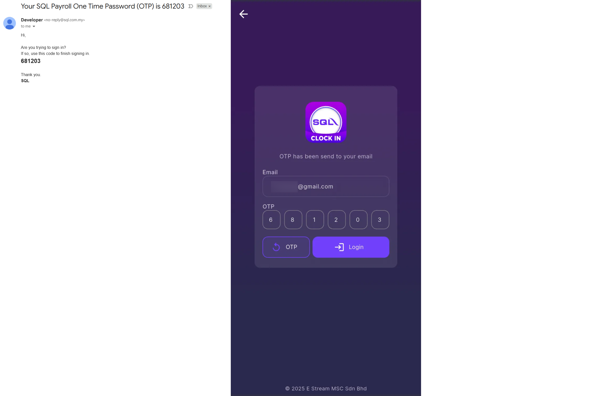
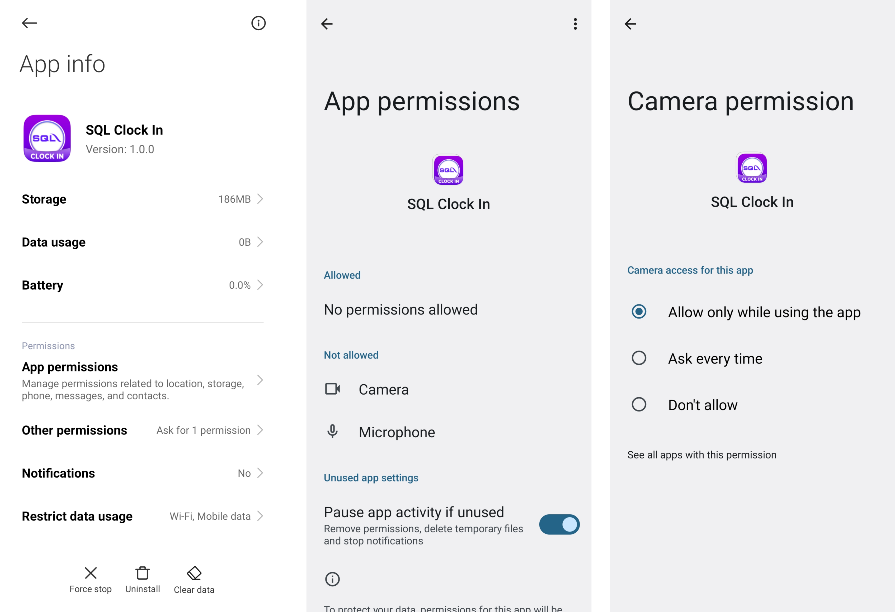
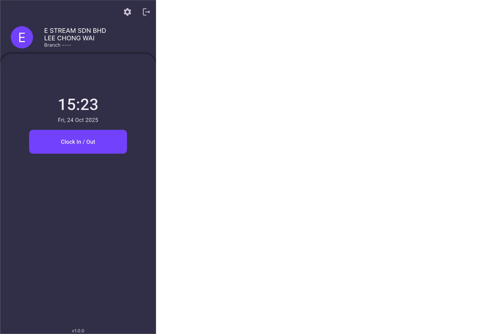
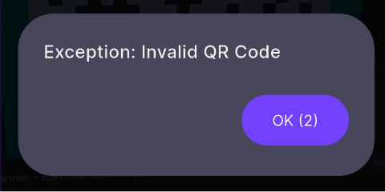
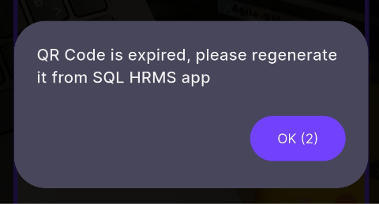
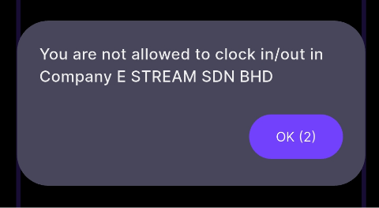
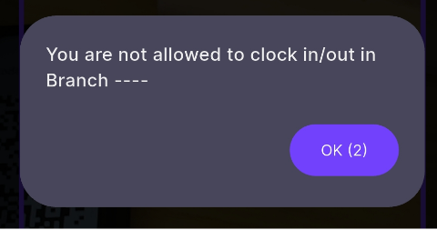
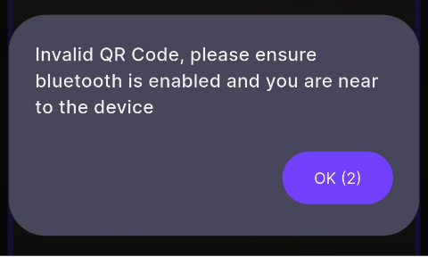
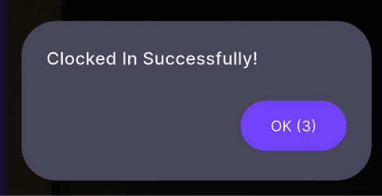

# SQL Clock In  

:::info
To setup Time Attendance QR Code, may refer to [Time Attendance Payroll Setup](hrms/e-tms/payroll-setup.md)
:::

## Login

### Login

:::info[IMPORTANT]
Only **Managers** are able to log into this app
:::

**Step 1:** Enter email | Next  

    <!--  -->  

**Step 2:** Enter OTP sent to your email | Login  

    <!--  -->  

**Step 3:** Select a company and branch  

    <!--  -->

### Try Live Demo  

User may try out the app as manager  

**Step 1:** Try Live Demo  

    <!--  -->

**Step 2:** Testing Company (Demo Data) | Select a Branch  

    <!--  -->

    - **Logout icon (top right):** Logout from SQL Clock In app  

## Permission  

### Camera  

**From SQL Clock In app**  

**Step:** Select ***'While using the app'***  

    <!--  -->

**From Device Settings**  

**Step:** App Info | App permissions | Camera  

    

## Dashboard  

    <!--  -->

    - ***'Clock In / Out'* button:** Navigate to [QR Scanner](#qr-scanner) 
    - **Gear icon (top right):** Navigate to [Settings](#settings)   
    - **Logout icon (top right):** Logout from SQL Clock In app  

## QR Scanner  

For employees to scan the QR Code generated from SQL HRMS app to clock in / out  

    <!--  -->

    - The scanner will enter a black screen after 3 minutes of inactivity  
      - It will be wake when there's motion detected  
      - The sensitivity can be adjusted in the [settings](#settings)
  
| **Dialog Message** | **Explanation** |  
| :----------------- | :-------------- |  
| <!--  --> | Employee scanned an invalid QR Code that is not generated from SQL HRMS app |  
| <!--  --> | Employee scanned an expired QR Code |  
| <!--  --> | Employee generated the QR Code under a different company and is not allowed to clock in / out |  
| <!--  --> | Employee is under a different branch and is not allowed to clock in / out |  
| <!--  --> | Employee has successfully clocked in |  
| <!--  --> | Employee has successfully clocked out |  

## Settings

    <!--  -->

    - **Camera View:** User can switch the default direction of the QR Scanner camera  
    - **Screen Wake Sensitivity:** User can adjust how sensitive they want their scanner to wake up from motion detection after entering black screen  