## Clock In & Attendance

### 1. Why do I see `Exception: [500] Error` or `Exception: [500] Insufficient Storage` when clocking in/out with attachments?

|`Exception: [500] Error`|`Exception: [500] Insufficient Storage`|
|---|---|
|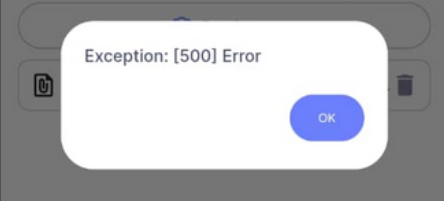|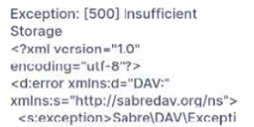|

**Cause:** SQL Drive storage is full.

**Fix:** Contact your service agent to extend your SQL Drive storage capacity.

### 2. Why can staff still clock in at their default branch after assigning Traveller locations?

Traveller lets employees clock in/out at multiple locations. Because every employee also has a default branch in Payroll, the system continues to allow clocking in/out at that default branch.

### 3. Why is the Clock In button disabled?

**Cause:** No *Working Calendar* is configured in Payroll.

**Fix:** Set up a work session by following the [Payroll setup guide](./payroll-setup.md).

### 4. When does the HRMS app reset clock in/out records?

The system resets according to the latest work session:

- **Work Day:** 12 hours after the work session end time
- **Public Holiday / Rest Day:** 16 hours after the last clock-out time

### 5. Can HRMS calculate salary for daily-rated workers using eTMS?

Yes. This requires system customization—contact your service agent for assistance.

---

## Sync & Record Management

### 6. Why do I get “Records synced until xxxxx. There might still be logs for xxxx on xxxxxx. Editing for this record is not allowed”?

**Cause:** Payroll only allows clock in/out edits two days after the original log date.

**Fix:**

- For same-day updates, use the **HRMS App**.
- For Payroll edits, wait two full days after the log date. (Example: 19/09/2025 log → editable on 21/09/2025.)

### 7. Why does the “Clock On Behalf” button disappear in the HRMS app?

Once Payroll logs are synced, the historical clock records are confirmed and the button is hidden. Check the last Payroll Update Date in the `Sync Cloud` dashboard—the button appears only for dates after that cutoff. (Example: if eTMS is updated to 17/09/2025, the button returns starting 18/09/2025.)

### 8. Why are some employees missing from the eTMS summary table?

The summary lists only employees flagged as *late in*, *early out*, *absent*, *OT*, or *on leave*. Staff with normal attendance do not appear.

### 9. Why do I see “Cannot view report. There are still records with errors ...”?

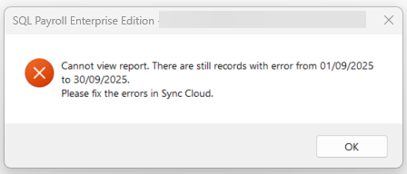

**Fix:**

1. Click the **Cloud** icon → **Sync All**.
2. Update every employee log.
   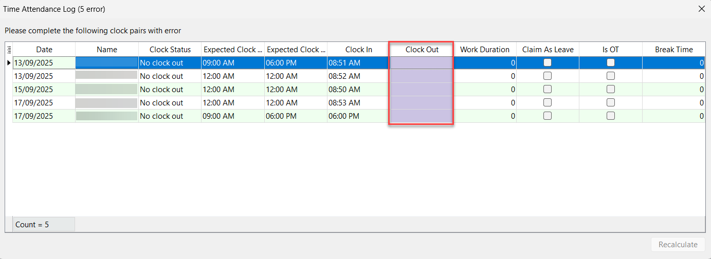

---

## Notifications & Mobile App

### 10. Why am I receiving Geofence notifications when I am not using eTMS?

Work sessions defined in Maintain Calendar trigger Geofence reminders even if eTMS is not actively used.

### 11. How can I stop Geofence notifications on Android?

1. Long-press the `SQL HRMS Geofence Services` notification.

   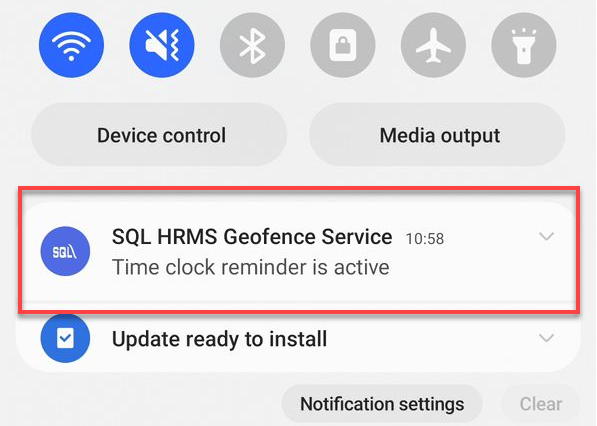
2. Tap **Settings**.

   
3. Open **Notification Categories**.

   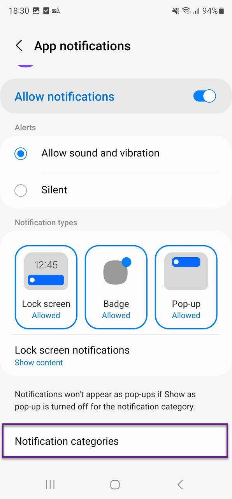
4. Turn off **SQL HRMS Geofence Service**.

   

### 12. Why does eTMS show “Updated to 01/01/2025” when there are no records?

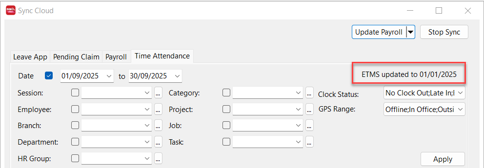

If no eTMS records exist, the system defaults the update date to the first day of the year.

### 13. Why does the OT duration differ between the Log tab and OT tab?

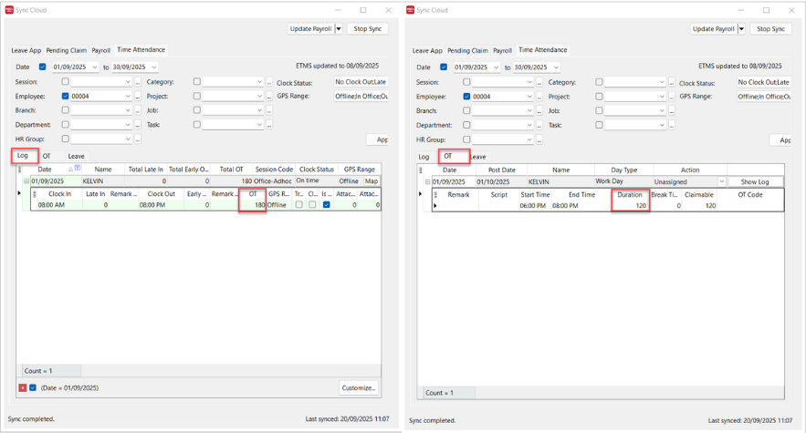

- **Log tab:** Shows all extra time based on actual clock-in/out times.
- **OT tab:** Applies company OT rules (for example, OT only counts after 6:00 pm).

**Scenario:** Work session 9:00 am–6:00 pm, employee clocks in at 8:50 am and out at 6:30 pm.

- Log tab → 40 minutes (10 minutes early + 30 minutes late).
- OT tab → 30 minutes (6:00 pm–6:30 pm per OT rules).

### 14. Can staff avoid being marked late by changing the phone time?

No. eTMS timestamps are recorded using the HRMS server time, so changing the device clock does not affect the recorded time.

### 15. How do I check who clocked in for an attendance log?

1. Open **HRMS App** → **TMS** → **Log**.
2. Select the relevant date.
3. Review the **On Behalf** column.

|`On Behalf`|Meaning|
|--|--|
|`-`|Employee clocked in/out themselves|
|`manager`|Manager clocked via HRMS app|
|`ADMIN`|HR/manager clocked via Payroll|

### 16. What does “ClientException with SocketException” mean?

The connection timed out. Refresh the page/app and try again.

---

## Reporting, Overtime & Leave

### 17. Why is the work session field blank on some dates in the Time Attendance Summary report?

Rest days and public holidays have no scheduled work session, so the field remains empty.

### 18. Why can’t I see every employee in the Time Attendance report?

The report respects your licensed eTMS user count and only displays records within that limit.

### 19. Do I need to clock in/out if I work OT during a break?

Yes. Clock out at the start of the break and clock back in when you begin OT.

|Work Session|Break Time|
|--|--|
|9:00 am–6:00 pm|1:00 pm–2:00 pm|

**Recommended steps:**

- 9:00 am → Clock in (start work)
- 1:00 pm → Clock out (start break)
- 1:00 pm → Clock in (start OT)
- 2:00 pm → Clock out (end OT)
- 2:00 pm → Clock in (resume normal work)

### 20. Why does the “Overtime Confirmation” message appear when claiming OT?

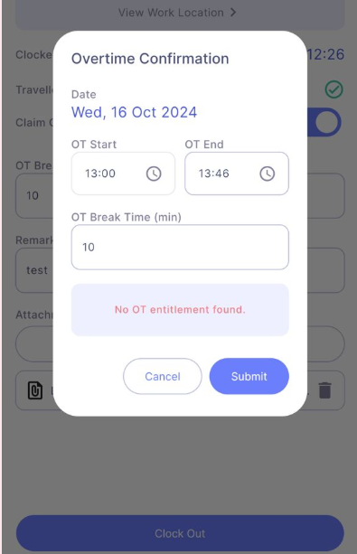

It appears when no OT entitlement is set for the work session during the selected period.

### 21. Why do I see “No OT detected. Clock out without Claim OT?”

You attempted to claim OT before the work session ended. Wait until the OT-eligible time before clocking out with OT.

### 22. Why does HRMS request “Always in use” location permission?

This permission enables:

- Clock-in reminders when you enter the work location.
- Clock-out reminders when you leave.
- Location monitoring during GPS-enforced sessions (starts at clock-in, stops at clock-out or after the auto-reset window). [Learn more](https://docs.sql.com.my/sqlpay/integration/hrms/e-tms/app-usage).

### 23. I forgot to tick “Claim OT” when clocking out. What now?

Ask HR to update the record in SQL Payroll:

1. In SQL Payroll, click the ☁ icon → **Sync All**.
2. Locate the log date → right-click → **Edit** → tick **Is OT**.

### 24. Why does “Location Not Matched” appear when I clock in/out?

1. Confirm that your device GPS is on and functioning.
2. Ensure you are within the assigned work location. Check under **View Work Location**.
   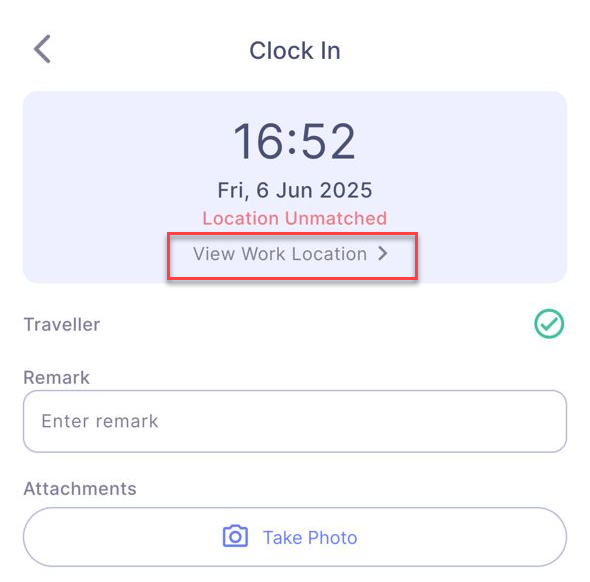

### 25. Why can’t I see “Claim As Leave” when clocking out?

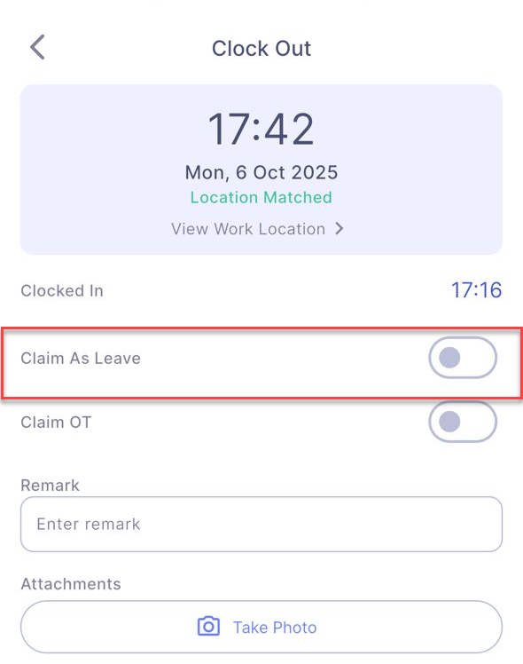

The option appears only when clocking out on a rest day or public holiday.
