## Location
Modules that require this permission:
- E TMS

### Android
**From SQL HRMS app**

**Step 1:** Turn on Location Service  

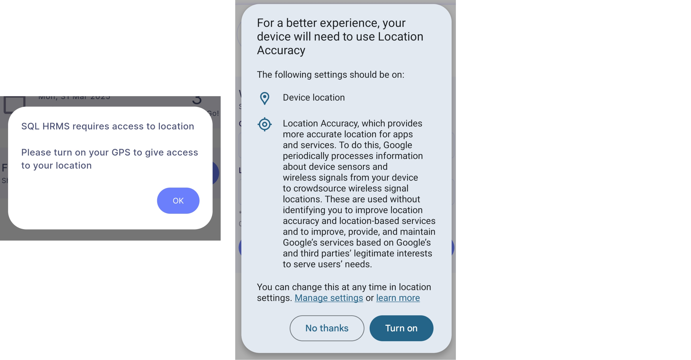

**Step 2:**  Allow Location Permission. When prompted, select ***'While using the app'***  

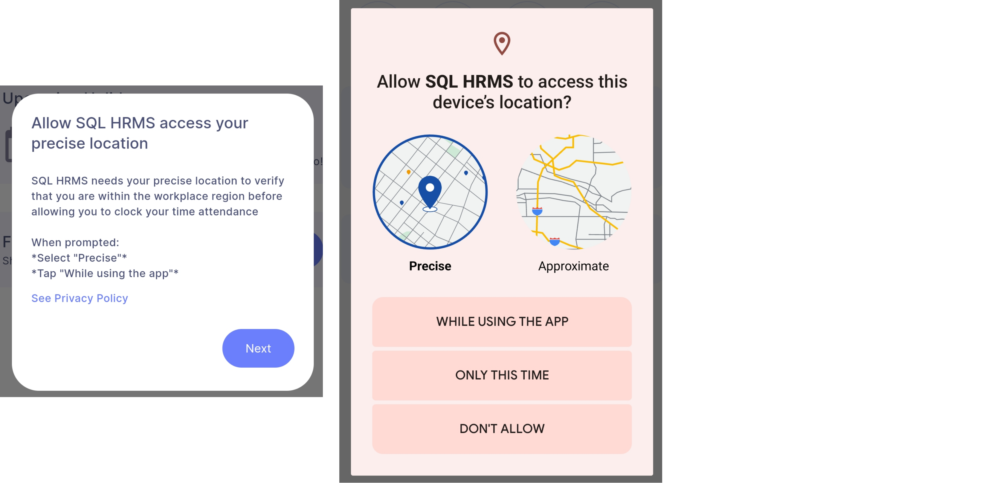

**Step 3:** Select ***'Update settings'*** and choose ***'Allow all the time'*** when the app prompts the following dialog box  

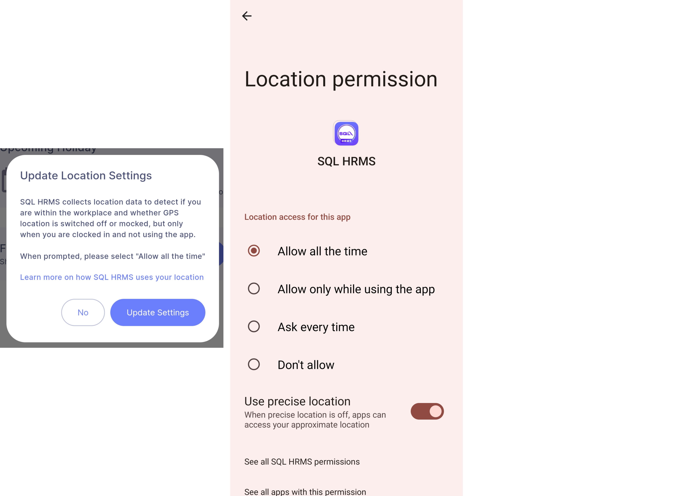

**From Device Settings**  

**Step:** App Info | App permissions | Location  

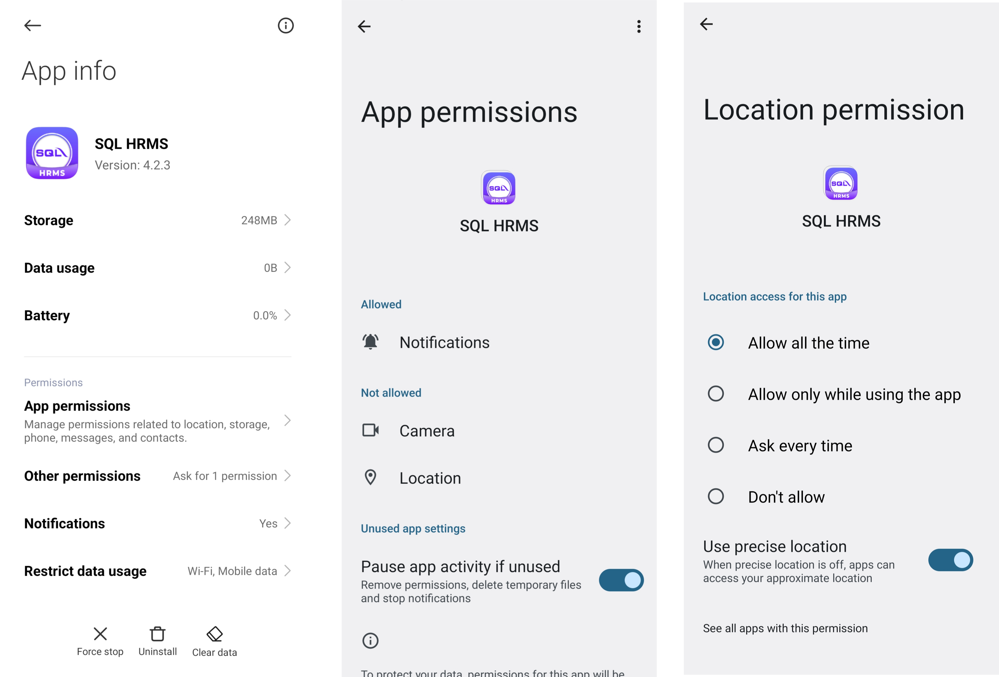

### iOS
**From SQL HRMS app**

**Step 1:** Settings | Privacy & Security | Location Service 

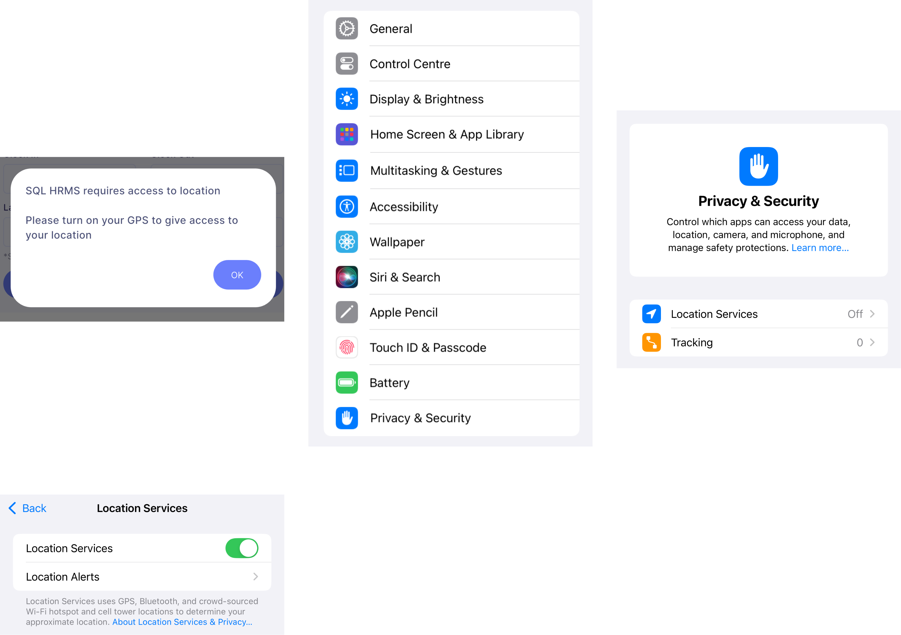

**Step 2:** Allow Location Permission. When prompted, select ***'Allow While Using App'***  

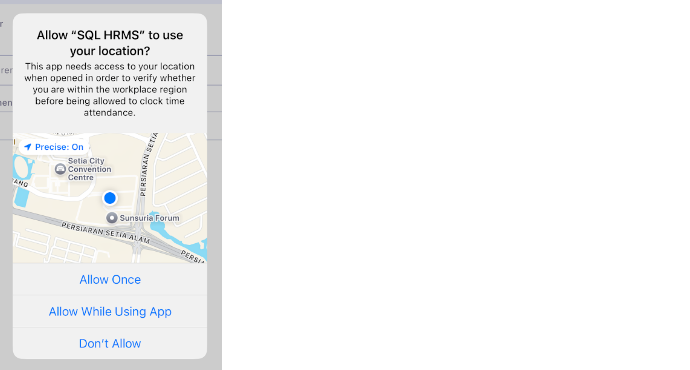

**Step 3:** Select ***'Change to Always Allow'*** 

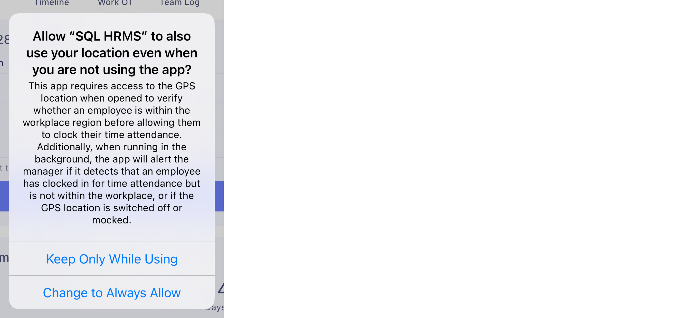

**From Device Settings**  

**Step:** Settings | Search 'SQL HRMS' | Location  

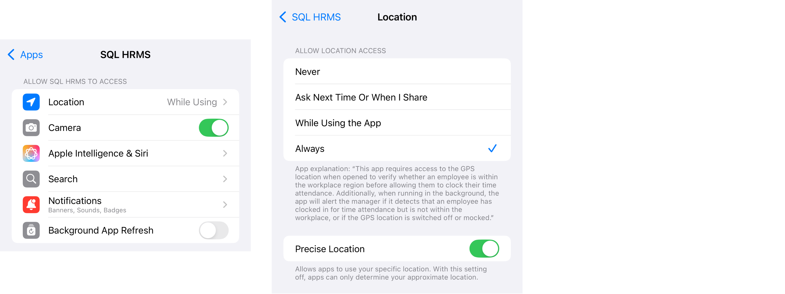

**Content & Privacy Restrictions**  

**Step 1:** Settings | Screen Time | Content & Privacy Restrictions  

:::info
If you have disabled this feature previously, you can skip all of the following steps
:::

**Step 2:** Enter your Screen Time Password if you have previously set one  

**Step 3:** Search 'Location Services' | Select ***'Allow Changes'*** and enable the ***'Location Services'*** toggle 

  

## Notification

### Android
**Step 1:** Direct to App Info | Permissions | Notifications

**Step 2:** Choose ***'All SQL HRMS notifications'***

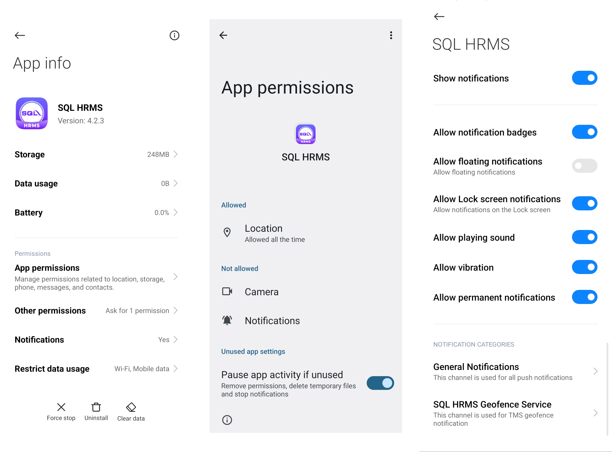

### iOS
**Step 1:** Direct to Settings | Search 'SQL HRMS'

**Step 2:** Turn on Notifications permission

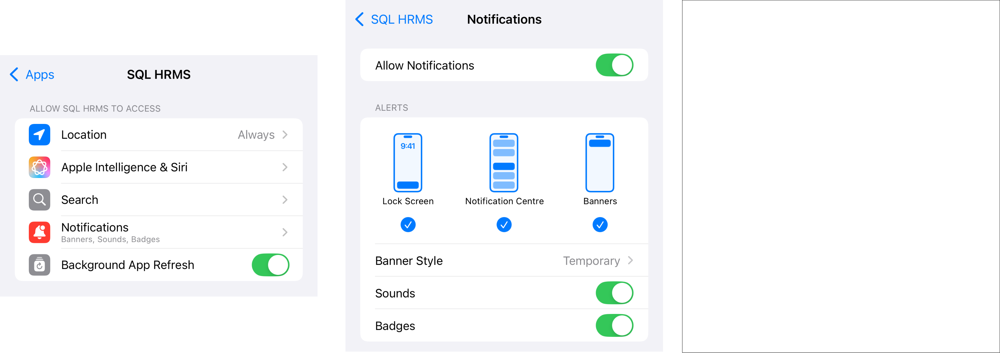

## Camera
Modules that require this permission: 
- E TMS
- E Leave
- E Claim

### Android

**Step 1:** Direct to App Info | Permissions | Camera  

**Step 2:** Choose ***'Allow only while using the app'***

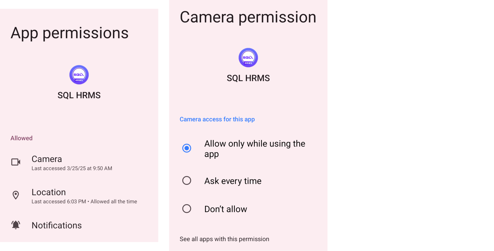

### iOS
**Step 1:** Direct to Settings | Search 'SQL HRMS'

**Step 2:** Turn on Camera permission

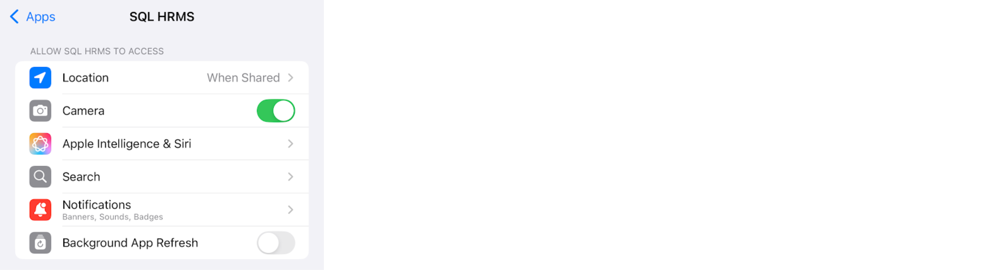