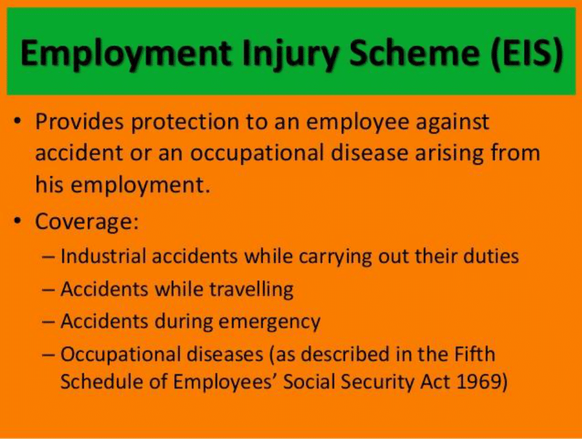

## What is Employment Insurance System (EIS)?

EIS is **a financial scheme** aimed at helping employees who have lost their jobs. It is managed by SOCSO. EIS is meant to enable retrenched workers to gain monetary funds for the first 6 months after being retrenched.

## EIS rate

- The contribution rate for Employment Insurance System (EIS) is 0.2% for the employer and 0.2% for employee based on the employee’s monthly salary.

## Who is subject to EIS?

- All employers in the private sector are required to pay monthly contributions for each of their employees. (Government employees, domestic workers and the self-employed are exempted).
- An employee is defined as a person who is employed for wages under a contract of service or apprenticeship with an employer. The contract of service or apprenticeship may be expressed or implied and may be oral or in writing.
- All employees aged 18 to 60 are required to contribute. However, employees aged 57 and above who have no prior contributions before the age of 57 are exempted.
- Contribution rates are capped at insured salary of RM4000.00.

## Who is eligible for EIS?

:::info
Important exception: Workers aged 57 and above who have never paid contributions before that age are NOT covered by Act 800 and are NOT required to contribute.

Act 800 does NOT cover domestic workers, the self-employed, civil servants and workers in local authorities and statutory bodies.
:::

1. Malaysian citizens / permanent resident
2. Aged 18-60
3. Working in the private sector
4. Employed based on a contract of service
